# Arquitectura y Plan de Implementación

Documento técnico de arquitectura para **TurZX 5.2" Display Manager**.
Diseño orientado a objetos en Python, pensado tanto para producción como para
aprender patrones de diseño en POO.

> Lee primero `PROJECT.md` para el contexto general del hardware y los
> requerimientos. Este documento se centra en **cómo** construir la solución.

---

## Decisiones de arquitectura

| Decisión | Elección | Razón |
|---|---|---|
| Abstracción de pantallas | **Strategy + Protocol** | Permite swapear drivers sin tocar el resto del sistema |
| Comunicación interna | **Event Bus (pub/sub)** | Sensores y renderer desacoplados, fácil agregar consumidores nuevos |
| FPS bridge | **Proceso separado** | Robustez vía systemd, falla del bridge no rompe el dashboard |
| Configuración | **YAML** | Legible, editable a mano, compatible con el ecosistema existente |
| Widgets | **Cada widget es una clase con `render()`** | OOP puro, ideal para aprender herencia y polimorfismo |
| Tests | **Diferidos** | Foco en funcionalidad, agregar tests después |

---

## Principios de diseño aplicados

El código se va a estructurar siguiendo estos principios. Cada uno se ejemplifica
con dónde aparece en el proyecto.

### SOLID
- **S — Single Responsibility**: cada clase hace una sola cosa. Ejemplo: `CpuSensor`
  solo lee CPU, no la dibuja ni la transmite.
- **O — Open/Closed**: agregar una pantalla nueva (8.8") no requiere modificar
  el renderer ni los sensores, solo crear un nuevo driver.
- **L — Liskov Substitution**: cualquier implementación de `DisplayDriver`
  puede reemplazar a otra sin romper el sistema.
- **I — Interface Segregation**: protocolos pequeños y específicos
  (`Renderable`, `Sensor`, `DisplayDriver`) en vez de una mega-interfaz.
- **D — Dependency Inversion**: las clases dependen de abstracciones
  (`Protocol`), no de implementaciones concretas.

### Patrones de diseño usados
- **Strategy**: para drivers de pantalla intercambiables.
- **Observer / Pub-Sub**: para el event bus.
- **Factory**: para crear widgets desde el YAML del tema.
- **Template Method**: en la clase base de sensores (`Sensor.read()` define
  el flujo, las subclases solo implementan el cómo).
- **Dependency Injection**: el `DisplayManager` recibe su driver, no lo crea.

---

## Diagrama de clases

```mermaid
classDiagram
    %% ============= PROTOCOLS (interfaces) =============
    class DisplayDriver {
        <<Protocol>>
        +connect() bool
        +disconnect() void
        +set_brightness(level: int) void
        +set_orientation(orient: Orientation) void
        +send_image(img: Image, x: int, y: int) void
        +upload_file(local: Path, remote: str) bool
        +play_media(remote_path: str) void
        +stop_media() void
        +get_dimensions() tuple
    }

    class Sensor {
        <<Protocol>>
        +name: str
        +read() SensorReading
        +interval: float
    }

    class Renderable {
        <<Protocol>>
        +render(canvas: Image, data: dict) void
        +x: int
        +y: int
    }

    %% ============= DISPLAY DRIVERS =============
    class TurZX52Driver {
        -dev: USBDevice
        -vendor_id: int
        -product_id: int
        +connect() bool
        +send_image(img, x, y) void
        +upload_file(local, remote) bool
        +play_media(path) void
        -_encrypt(data: bytes) bytes
        -_send_command(cmd_id: int) bytes
    }

    class TurZX88Driver {
        +connect() bool
        +send_image(img, x, y) void
    }

    class MockDriver {
        +connect() bool
        +send_image(img, x, y) void
    }

    %% ============= EVENT BUS =============
    class EventBus {
        -_subscribers: dict
        +subscribe(event: str, callback) void
        +unsubscribe(event: str, callback) void
        +publish(event: str, data) void
    }

    class SensorReading {
        <<dataclass>>
        +name: str
        +value: float
        +unit: str
        +timestamp: float
    }

    %% ============= SENSORS =============
    class BaseSensor {
        <<abstract>>
        +name: str
        +interval: float
        -_last_reading: SensorReading
        +read() SensorReading
        #_read_raw()* float
    }

    class CpuSensor {
        #_read_raw() float
    }

    class GpuSensor {
        -_backend: GpuBackend
        #_read_raw() float
    }

    class MemorySensor {
        #_read_raw() float
    }

    class FpsSensor {
        -json_path: Path
        #_read_raw() float
    }

    class GpuBackend {
        <<Protocol>>
        +get_load() float
        +get_temp() float
        +get_memory() tuple
    }

    class NvidiaBackend {
        +get_load() float
    }

    class AmdBackend {
        +get_load() float
    }

    %% ============= WIDGETS =============
    class BaseWidget {
        <<abstract>>
        +x: int
        +y: int
        +data_source: str
        +render(canvas, data)* void
    }

    class TextWidget {
        +font: str
        +font_size: int
        +color: tuple
        +format: str
        +render(canvas, data) void
    }

    class ProgressBarWidget {
        +width: int
        +height: int
        +color: tuple
        +render(canvas, data) void
    }

    class LineGraphWidget {
        +history_size: int
        -_history: list
        +render(canvas, data) void
    }

    class ImageWidget {
        +source: Path
        +render(canvas, data) void
    }

    class WidgetFactory {
        +create_from_config(config: dict)$ BaseWidget
    }

    %% ============= THEME =============
    class Theme {
        +name: str
        +author: str
        +display_size: tuple
        +background: Path
        +widgets: list
        +load_from_yaml(path: Path)$ Theme
    }

    class ThemeLoader {
        +load(path: Path)$ Theme
        -_parse_widgets(config: dict) list
    }

    %% ============= RENDERER =============
    class Renderer {
        -driver: DisplayDriver
        -event_bus: EventBus
        -theme: Theme
        -canvas: Image
        -_last_canvas: Image
        +start() void
        +stop() void
        -_compose_frame() Image
        -_apply_delta() void
        -_on_sensor_update(data) void
    }

    %% ============= ORCHESTRATOR =============
    class DisplayManager {
        -driver: DisplayDriver
        -renderer: Renderer
        -sensors: list
        -event_bus: EventBus
        -theme: Theme
        +start() void
        +stop() void
        +load_theme(path: Path) void
    }

    %% ============= GUI =============
    class ControlCenter {
        -manager: DisplayManager
        +show() void
        +on_theme_change() void
    }

    class LayoutEditor {
        -theme: Theme
        +open_editor() void
        +save_layout() void
    }

    %% ============= RELATIONSHIPS =============
    TurZX52Driver ..|> DisplayDriver : implements
    TurZX88Driver ..|> DisplayDriver : implements
    MockDriver ..|> DisplayDriver : implements

    BaseSensor ..|> Sensor : implements
    CpuSensor --|> BaseSensor : extends
    GpuSensor --|> BaseSensor : extends
    MemorySensor --|> BaseSensor : extends
    FpsSensor --|> BaseSensor : extends

    NvidiaBackend ..|> GpuBackend : implements
    AmdBackend ..|> GpuBackend : implements
    GpuSensor o-- GpuBackend : uses

    BaseWidget ..|> Renderable : implements
    TextWidget --|> BaseWidget : extends
    ProgressBarWidget --|> BaseWidget : extends
    LineGraphWidget --|> BaseWidget : extends
    ImageWidget --|> BaseWidget : extends

    WidgetFactory ..> BaseWidget : creates
    ThemeLoader ..> Theme : creates
    ThemeLoader ..> WidgetFactory : uses

    Theme o-- BaseWidget : contains many

    BaseSensor ..> EventBus : publishes to
    Renderer ..> EventBus : subscribes to
    Renderer o-- DisplayDriver : uses
    Renderer o-- Theme : uses

    DisplayManager o-- DisplayDriver : owns
    DisplayManager o-- Renderer : owns
    DisplayManager o-- EventBus : owns
    DisplayManager o-- BaseSensor : owns many

    ControlCenter o-- DisplayManager : controls
    LayoutEditor o-- Theme : edits

    BaseSensor ..> SensorReading : produces
```



---

## Estructura de carpetas

```
turzx-app/
├── main.py                          # Entry point — instancia DisplayManager
├── fps_bridge.py                    # Proceso separado MangoHud → JSON
│
├── core/
│   ├── __init__.py
│   ├── event_bus.py                 # EventBus (pub/sub central)
│   ├── manager.py                   # DisplayManager (orquestador)
│   └── renderer.py                  # Renderer (loop principal de dibujo)
│
├── drivers/
│   ├── __init__.py
│   ├── base.py                      # Protocol DisplayDriver
│   ├── turzx_52.py                  # Driver del 5.2" (foco actual)
│   ├── turzx_88.py                  # Stub para futuro
│   └── mock.py                      # Driver de prueba (escribe a PNG)
│
├── sensors/
│   ├── __init__.py
│   ├── base.py                      # BaseSensor + SensorReading dataclass
│   ├── cpu.py
│   ├── gpu/
│   │   ├── __init__.py
│   │   ├── base.py                  # GpuBackend Protocol
│   │   ├── nvidia.py
│   │   └── amd.py
│   ├── memory.py
│   ├── disk.py
│   ├── network.py
│   └── fps.py                       # Lee /tmp/mangohud_stats.json
│
├── widgets/
│   ├── __init__.py
│   ├── base.py                      # BaseWidget (abstract)
│   ├── text.py
│   ├── progress_bar.py
│   ├── line_graph.py
│   ├── image.py
│   └── factory.py                   # WidgetFactory
│
├── themes/
│   ├── __init__.py
│   ├── theme.py                     # Theme dataclass
│   ├── loader.py                    # ThemeLoader (YAML → Theme)
│   └── presets/                     # Temas predefinidos incluidos
│       └── default/
│           ├── theme.yaml
│           └── background.mp4
│
├── gui/
│   ├── __init__.py
│   ├── control_center.py            # PyQt6 ventana principal
│   ├── layout_editor.py             # Drag & drop editor
│   └── widgets/                     # Componentes Qt reutilizables
│
├── utils/
│   ├── __init__.py
│   ├── video.py                     # Conversión MP4 → H.264
│   ├── delta.py                     # Delta compression de frames
│   └── logger.py
│
├── config/
│   ├── config.yaml                  # Configuración global
│   └── layout.json                  # Layout dinámico del editor
│
├── systemd/
│   ├── turzx-dashboard.service
│   └── turzx-fps-bridge.service
│
├── requirements.txt
├── PROJECT.md                       # Specs y requisitos
└── ARCHITECTURE.md                  # Este archivo
```

---

## Hitos de implementación

Cada hito es **funcional de punta a punta** — al terminarlo deberías poder ejecutar
algo concreto y ver un resultado. Los hitos posteriores construyen sobre los anteriores.

### Hito 1 — Conexión con el dispositivo

**Objetivo**: poder conectarse a la pantalla, hacer el handshake y cambiar el brillo.

**Clases a implementar**:
- `drivers/base.py` → `DisplayDriver` (Protocol)
- `drivers/turzx_52.py` → `TurZX52Driver` con:
  - `connect()` / `disconnect()`
  - `set_brightness(level)`
  - `_encrypt(data)` (DES con clave `slv3tuzx`)
  - `_send_command(cmd_id, payload)`
- `drivers/mock.py` → `MockDriver` que loguea sin enviar nada

**Conceptos de POO aprendidos**:
- Protocol como interfaz duck-typed
- Encapsulación con métodos privados (`_send_command`)
- Strategy pattern (driver intercambiable)

**Criterio de éxito**: script de prueba que conecta, sube el brillo a 100, espera 2 seg, lo baja a 0 y desconecta.

---

### Hito 2 — Enviar imagen y video al dispositivo

**Objetivo**: enviar una imagen PNG estática a la pantalla, y stremear un video H.264 por USB.

**Clases a implementar**:
- Extender `TurZX52Driver` con:
  - `send_image(img: PIL.Image, x, y)`
  - `stream_video(path: Path)` (chunks H.264 por USB)
- `utils/video.py` → función `mp4_to_h264(input, output)`
- `utils/delta.py` → función `compute_delta(prev, curr)` (devuelve rectángulo modificado)

**Conceptos de POO aprendidos**:
- Métodos de instancia vs. funciones utilitarias
- Composición (driver usa utilidades)
- Type hints avanzados (`Path`, `PIL.Image.Image`)

**Criterio de éxito**: enviar un PNG a la pantalla y reproducir un video por streaming USB.

---

### Hito 3 — Uso de la micro SD interna

**Objetivo**: subir un video a la micro SD interna de la pantalla y reproducirlo de forma nativa (0% CPU/USB).

**Clases a implementar**:
- Extender `TurZX52Driver` con:
  - `upload_file(local: Path, remote: str) -> bool`
  - `play_media(remote_path: str)`
  - `stop_media()`
  - `delete_file(remote: str)`
  - `list_files(remote_dir: str) -> list[str]`
  - `get_storage_info() -> StorageInfo`

**Conceptos de POO aprendidos**:
- Dataclasses (`StorageInfo`)
- Manejo de recursos con context managers
- Iteradores y generadores (chunks de archivo)

**Criterio de éxito**: el video se sube una vez, queda en la SD, y se reproduce con un solo comando sin tráfico USB durante la reproducción.

---

### Hito 4 — Streaming de datos del sistema

**Objetivo**: leer sensores del PC (CPU, GPU, RAM) y dibujarlos sobre la pantalla en tiempo real con video de fondo desde la SD.

**Clases a implementar**:
- `core/event_bus.py` → `EventBus` con `subscribe()`, `publish()`, `unsubscribe()`
- `sensors/base.py` → `BaseSensor` (abstract) + `SensorReading` (dataclass)
- `sensors/cpu.py` → `CpuSensor(BaseSensor)`
- `sensors/gpu/base.py` → `GpuBackend` (Protocol)
- `sensors/gpu/nvidia.py` + `sensors/gpu/amd.py` → backends
- `sensors/gpu/__init__.py` → factory `detect_gpu_backend()`
- `sensors/memory.py`, `sensors/disk.py`, `sensors/network.py`
- `widgets/base.py` → `BaseWidget` (abstract con `render()`)
- `widgets/text.py`, `widgets/progress_bar.py`, `widgets/line_graph.py`
- `widgets/factory.py` → `WidgetFactory.create_from_config()`
- `themes/theme.py` + `themes/loader.py`
- `core/renderer.py` → `Renderer` que suscribe al bus y dibuja
- `core/manager.py` → `DisplayManager` orquestador
- `main.py` → entry point

**Conceptos de POO aprendidos**:
- Clases abstractas con `abc.ABC` y `@abstractmethod`
- Herencia profunda (BaseSensor → CpuSensor)
- Observer pattern (event bus)
- Factory pattern (WidgetFactory)
- Template Method (BaseSensor.read() define el flujo)
- Composición vs herencia (sensores componen backends, widgets heredan de base)

**Criterio de éxito**: la pantalla muestra video de fondo + overlay de stats actualizándose en tiempo real, todo cargado desde un `theme.yaml`.

---

### Hito 5 — GUI para diseñar temas

**Objetivo**: aplicación PyQt6 con panel de control y editor visual drag & drop de widgets.

**Clases a implementar**:
- `gui/control_center.py` → `ControlCenter(QMainWindow)`:
  - Selector de tema activo
  - Botones iniciar/detener
  - Estado del servicio (running/stopped)
  - Slider de brillo
- `gui/layout_editor.py` → `LayoutEditor(QWidget)`:
  - Canvas a escala 50% (360×640 px)
  - Widgets arrastrables con `QGraphicsScene`/`QGraphicsItem`
  - Guardado automático a `layout.json` al cerrar
  - Vista previa en vivo en la pantalla física
- `gui/widgets/` → componentes Qt reutilizables (selector de color, slider con label, etc.)

**Conceptos de POO aprendidos**:
- Herencia múltiple en Qt
- Signals & slots (otro patrón observer)
- Model-View separation
- Event handling

**Criterio de éxito**: abrir la GUI, mover widgets en el canvas con el mouse, ver los cambios reflejados en la pantalla física, guardar el tema modificado.

---

### Hito 6 — Vinculación con MangoHud para FPS

**Objetivo**: proceso separado que detecta juegos activos y publica los FPS, integrado con el dashboard.

**Clases a implementar**:
- `fps_bridge.py` → script standalone:
  - `MangoHudWatcher` clase que poll-ea `~/mangohud_logs/`
  - Detección de juego activo (archivo modificado < 3 seg)
  - Escritura a `/tmp/mangohud_stats.json`
- `sensors/fps.py` → `FpsSensor(BaseSensor)`:
  - Lee `/tmp/mangohud_stats.json`
  - Publica al event bus como cualquier otro sensor
- `systemd/turzx-fps-bridge.service`
- `systemd/turzx-dashboard.service`

**Conceptos de POO aprendidos**:
- IPC (comunicación entre procesos) via archivos
- Diseño de procesos independientes
- Manejo de fallos parciales (el dashboard sigue si el bridge muere)

**Criterio de éxito**: abrir un juego con MangoHud activo, ver los FPS aparecer en la pantalla, cerrar el juego y ver que la métrica desaparece elegantemente.

---

## Roadmap futuro (post-MVP)

Cuando los 6 hitos estén completos:
- Optimización con NumPy vectorizado en el renderer
- Reescritura del compositing en Rust via PyO3 (si el consumo de CPU sigue alto)
- Soporte para más modelos TurZX (8.0", 8.8", 9.2", 12.3")
- Tests unitarios sobre el núcleo
- Empaquetado como AppImage o paquete Arch (PKGBUILD)
- Plugin system para sensores y widgets externos

---

## Notas para el agente de desarrollo

- **No reimplementar el protocolo USB desde cero** — usar `lcd_comm_turing_usb.py`
  del repo `mathoudebine/turing-smart-screen-python` como referencia de los comandos
  encriptados. Lo que sí hay que hacer es **envolverlo en la arquitectura POO** descrita acá.
- **Cada hito debe ser ejecutable independientemente** — al terminar el Hito 1
  debe haber un script de prueba que demuestre la conexión, no esperar al final.
- **Protocols sobre ABC cuando sea posible** — `typing.Protocol` permite duck typing
  más flexible que clases abstractas tradicionales.
- **Dataclasses para datos, clases para comportamiento** — `SensorReading` es una
  dataclass, `CpuSensor` es una clase con métodos.
- **El event bus es síncrono al principio** — si después se necesita asíncrono,
  refactorizar es trivial gracias al desacoplamiento.
- **El driver del 5.2" es el foco** — los otros drivers son stubs que solo declaran
  que existen, no se implementan ahora.
